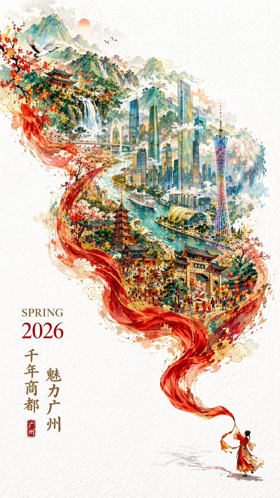

<h1>✨ Awesome GPT Image 2 Prompts</h1>

A curated collection of high-quality prompts and examples for GPT Image 2 — portraits, posters, UI mockups, character design, and more.

**[🚀 Generate images free → gptimager.com](https://gptimager.com)**

---

## Introduction

This repository collects the best prompts and output examples for **GPT Image 2** (OpenAI's latest image generation model). Whether you're building products, creating art, or just exploring — copy any prompt and try it instantly on [gptimager.com](https://gptimager.com).

If you find this useful, please ⭐ star this repo!

---

## 📑 Contents

- [Portrait & Photography](#portrait--photography)
- [Poster & Illustration](#poster--illustration)
- [UI & Creative](#ui--creative)
- [Character & Design](#character--design)

---

## Portrait & Photography

### Case 1: Convenience Store Neon Portrait

**Prompt:**
> 35mm film photography with harsh convenience store fluorescent lighting mixed with colorful neon signs from outside, authentic film grain, high contrast, slight color cast, cinematic street editorial style, intimate medium shot, early 20s sexy Chinese female idol with ultra-realistic delicate refined Chinese features, seductive almond-shaped fox eyes with natural double eyelids, high nose bridge, small sharp V-shaped jawline, flawless porcelain skin with cool ivory undertone and visible specular highlights from fluorescent light, subtle skin texture and micro pores, natural dewy makeup with soft flush on cheeks, glossy natural pink lips slightly parted, subtle natural freckles across nose and cheeks, long dark brown hair in a messy high ponytail with many loose strands falling around face and neck, wearing an oversized white button-up shirt as the only top, unbuttoned at the top with deep cleavage and loosely tied at the waist, paired with a tiny black pleated mini skirt, barefoot in simple white slides, seductive casual leaning pose against the glass door of a 24-hour convenience store at late night, intensely seductive playful yet slightly vulnerable gaze straight at the viewer, bright cold fluorescent store light from inside mixed with pink and blue neon glow from outside signs, authentic late-night convenience store atmosphere

---

### Case 2: Cinematic Minimal Portrait

**Prompt:**
> Generate a cinematic minimal portrait of a solitary man standing in an intense orange to red gradient environment, strong silhouette lighting, deep shadow contrast, reflective glossy floor, symmetrical composition, minimal

---

### Case 3: Japanese Onsen Ryokan Portrait

**Prompt:**
> 35mm film photography, warm vintage Japanese onsen ryokan aesthetic, soft ambient wooden lantern lighting mixed with gentle natural window light, subtle film grain, gentle color shift, high atmosphere editorial style, intimate medium shot, early 20s beautiful Chinese female idol with ultra-realistic delicate refined Chinese features, seductive almond-shaped fox eyes with natural double eyelids, high nose bridge, small sharp V-shaped jawline, flawless porcelain skin with warm ivory undertone, visible subtle skin texture and micro pores, soft natural makeup with dewy glow, long dark brown hair tied in a loose low bun with some messy strands falling around face and neck, wearing a loose white yukata (traditional Japanese bathrobe) deliberately slipped off one shoulder and loosely tied at the waist, seductive relaxed sitting pose on the edge of a traditional wooden engawa veranda at a vintage onsen ryokan, warm wooden interior with paper sliding doors and distant steaming hot spring in soft focus, authentic vintage film color grading with warm tones

---

### Case 4: 35mm Flash Editorial Portrait

**Prompt:**
> 35mm color film photography with harsh direct on-camera flash, specular highlights on skin and clothing, strong catchlights in eyes, high contrast flash illumination, authentic film grain and color shift, high fashion fresh innocent basketball court editorial style, intimate first-person low-angle POV shot from below, early 20s sexy Chinese female idol with ultra-realistic delicate refined Chinese features, seductive almond-shaped fox eyes with natural double eyelids, high nose bridge, small sharp V-shaped jawline, flawless realistic porcelain skin, long dark brown hair tied in a high playful ponytail, wearing a loose white tank top and white high-waisted basketball shorts, white knee-high sports socks, seductive natural leaning pose against the basketball hoop pole on the outdoor court at dusk, intensely seductive playful yet pitiable doe-eyed gaze straight at the viewer, harsh direct on-camera flash creating sharp specular highlights and strong catchlights, background with blurred basketball court and hoop under dusk sky, authentic 35mm direct flash film basketball court look --ar 9:16

---

### Case 5: Mirror Selfie Bedroom Portrait

**Prompt:**
> A stunning 18-year-old Chinese girl with a youthful, pure face and realistic skin texture, sitting on a cozy, slightly messy bed in her bedroom. She is taking a mirror selfie with a smartphone, capturing a natural and intimate moment. Wearing casual gray loungewear and neat white crew socks. Soft natural light (golden hour) streams in from a side window, creating a warm, moody, and cinematic atmosphere. 35mm lens, sharp focus on the subject in the mirror, depth of field with a beautifully blurred background (bokeh). Photorealistic, 8K, high resolution, studio quality, masterpiece. Negative Prompts: no extra limbs, no deformed hands, no blur, no noise, no watermark, no text, no cartoon/anime style. Aspect Ratio: 3:4.

---

## Poster & Illustration

### Case 1: Boston Spring 2026 City Poster

**Prompt:**
> A striking Spring 2026 city poster for Boston with an elegant celebratory mood and a bold contemporary design. On a clean off-white textured background with large areas of negative space, a miniature single sculler rows across the lower right corner of the image on a narrow ribbon of reflective water. The wake from the oar sweeps upward in a dynamic calligraphic curve, gradually transforming into the Charles River and then into a dreamlike hand-painted panorama of Boston. Inside this flowing river-shaped composition are iconic Boston elements: the Back Bay skyline, Beacon Hill brownstones, Acorn Street, Boston Public Garden, Swan Boats, Zakim Bridge, Fenway-inspired details, historic brick architecture, harbor ferries, and the city's waterfront atmosphere. Soft morning fog, golden spring light, subtle festive accents in crimson and gold, rich detail, layered depth, sophisticated city-poster aesthetics, fresh and refined, visually powerful but not overcrowded. Elegant typography in the lower left reads "SPRING 2026" with a vertical slogan "BOSTON, A CITY OF RIVER, MEMORY, AND INVENTION", text clear and beautifully composed, premium graphic design, 9:16

---

### Case 2: Vintage Amalfi Travel Poster

**Prompt:**
> Modern pencil illustration of Vintage travel poster illustration of the Amalfi Coast, Italy, panoramic coastal cliff road scene, classic 1960s white car driving along a curved seaside road, deep blue Mediterranean sea with small sailboats, colorful pastel hillside village, bright blue sky with soft clouds, lemon tree branches with vibrant yellow lemons framing the foreground, warm summer sunlight, bold vibrant colors, retro 1950s travel poster style, cinematic composition, high detail, screen print texture, graphic illustration. Hand-drawn style, illustration with loose strokes and defined contours. High-contrast color palette, maintaining chromatic harmony between background and elements. Contemporary and decorative aesthetic.

---

### Case 3: Chengdu Food Map Illustration

**Prompt:**
> 一张手绘风格的城市美食地图，以成都为主题。画面以鸟瞰视角的手绘简化城市地图为底，标注主要道路和地标但不追求精确比例而是追求可爱的手绘感。地图上分布着12个美食地点的精致手绘小插画：春熙路的串串香（一把竹签插着各种食材冒着热气）、宽窄巷子的三大炮（三个糯米团子飞向铜盘）、建设路的蛋烘糕（金黄酥脆正在翻面）、玉林路的火锅（九宫格锅翻滚冒泡）等，每个插画约占地图的5%面积，旁边用手写体标注店名和一句推荐语"凌晨两点还在排队的那家"。地图边缘用手绘藤蔓和辣椒装饰形成边框。右下角有一个手绘指南针和图例说明。左上角标题"成都·吃货暴走地图"使用胖圆的手绘美术字配辣椒装饰。整体画风为水彩+彩铅混合的手绘质感，颜色以暖色系（辣椒红、姜黄、翠绿）为主，图片比例1:1。

---

### Case 4: Chinese Minimalist S-Shaped Poster

**Prompt:**
> 极简新中式美学风格，画面以淡雅的灰白色为底，呈现出一种纸艺剪影般的立体感。一条S形蜿蜒的裂痕状边缘将画面分割，仿佛撕开了一层纸面，露出内部色彩斑斓的东方山水景象。裂口内，一条蜿蜒的河流自上而下贯穿整个构图，河水以深浅不一的蓝色渲染，层次分明，仿佛流动的丝带。河岸两侧点缀着青翠的山丘与梯田，色彩柔和，绿红交织，展现出田园的宁静之美。沿河而建的古风建筑错落有致，飞檐翘角，白墙黛瓦，在光影的映衬下更显古朴典雅。整体构图呈S形曲线，富有韵律感，画作边缘采用撕纸效果，营造出立体浮雕般的视觉体验。下方题字"东方美学"以黑色楷体书写，底部"CHINA"字样庄重醒目。

---

### Case 5: 2026 Spring Guangzhou City Poster

**Prompt:**
> 一张充满新春喜庆氛围但不失高雅格调的2026城市宣传海报。双重曝光，构图延续了S型的流动感；在纯白的纹理背景右下角，一个身穿中国传统服饰的微缩人物正在挥舞着一条长长的红色丝绸舞带，这条红绸在空中舞动，更在向左上方飘动的过程中，奇幻地变形成了一条壮丽的山脉河流。在这条"河流"中，叠加了一个有山有海河的广州城市手绘图，国潮，景色尽在眼底，壮阔雄伟，令人震撼。广州的地标建筑（广州塔，珠江新城建筑群，珠江，广州城里古建筑，游轮，白云山）。云雾环绕，仙气缥缈，色彩丰富，结构复杂，细节丰富，但因为大面积的留白，画面依然显得清新脱俗，左下角排版着"SPRING 2026"和竖排的宣传语，整体寓意"千年商都，魅力广州"。文字排版优美，大方，字迹清晰完整，尺寸9:16。

---

## UI & Creative

### Case 1: One-Prompt UI Design Generation

**Prompt:**
> 用这种风格帮我生成一套UI设计系统，包含网页、移动端、卡片、控件、按钮 以及其它

---

### Case 2: Amateur iPhone Keynote Snapshot

**Prompt:**
> Amateur iPhone photo at Apple Park during the iPhone 20 keynote, Tim Cook presenting on stage. Shot from the crowd at a distance

---

### Case 3: Handwritten Notebook Photo

**Prompt:**
> Amateur photo of an open notebook lying flat, filled with handwritten notes in black ballpoint pen. The handwriting is casual and slightly messy, like personal notes, natural imperfections, crossed out words, underlined headings. Shot from slightly above, natural daylight from a window, no flash. Casual desk setting, shot on iPhone

---

## Character & Design

### Case 1: Anime Snapshot Conversion

**Prompt:**
> Show me the attached image as a snapshot from an actual anime

---

### Case 2: Character Reference Card

**Prompt:**
> 基于此角色和背景，请制作一份类似官方设定资料的角色资料卡。包含三视图：正面、侧面和背面；添加角色面部表情的变化；分解并展示服装和装备的详细部分；添加色板；包含世界观设定的简要说明；总体上，使用有组织的布局（白色背景，插画风格）高分辨率、专业概念艺术风格

---

### Case 3: Gal Game Character Introduction Page

**Prompt:**
> 最新モデルの画像生成ツールを使用して、このちびキャライラストと立ち絵を使って本物のサイトページのようにキャラクター紹介ページ風イラストを作ってください。ギャルゲーのキャラクター紹介ページをイメージした高品質なもの。顔の差分なども乗っている、CGイラストが存在する。ちびキャラが存在する。名前:（ここに名前）、イメージカラー:（ここに色）、身長:（ここに身長）cm、キャッチコピー:"「ここにセリフ」"

---

### Case 4: Character Sheet (3-View)

**Prompt:**
> このキャラクターと背景を元に、公式設定資料のようなキャラクターシートを作成してください。正面、側面、背面の3面図を含める；キャラクターの表情バリエーションを追加；衣装や装備の詳細パーツを分解して表示；カラーパレットを追加；世界観の簡単な説明を入れる；全体は整理されたレイアウト（白背景、図解風）；アスペクト比16：9；高解像度、プロのコンセプトアートスタイル

---

## Contributing

Have a great prompt? Submit a pull request!

1. Add your image to `images/`
2. Add a new case entry to the relevant section in `README.md`
3. Include the full prompt text

---

## License

[CC BY 4.0](LICENSE) — Free to use with attribution.

---

**[🚀 Try GPT Image 2 free at gptimager.com](https://gptimager.com)**

Made with ❤️ by [gptimager.com](https://gptimager.com)

